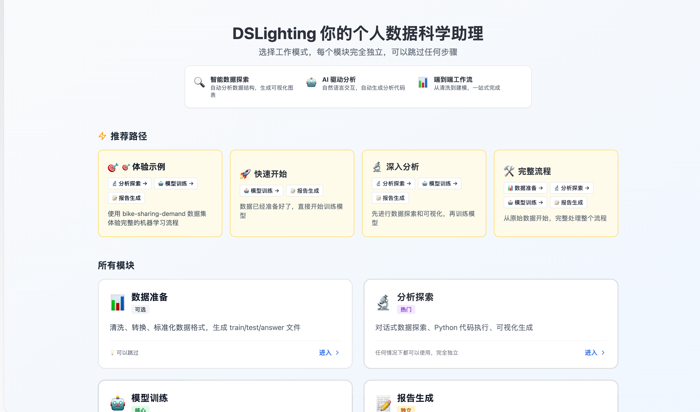
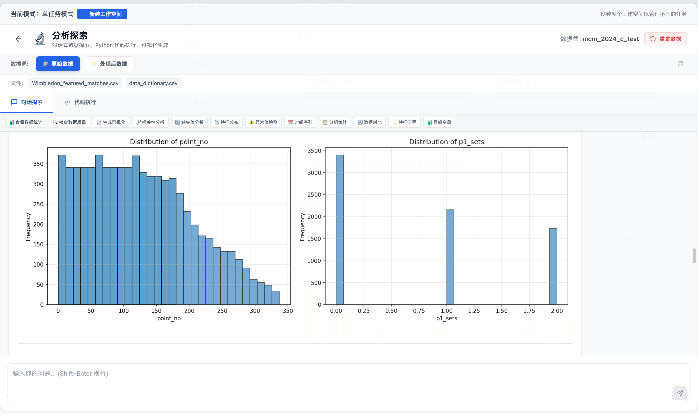
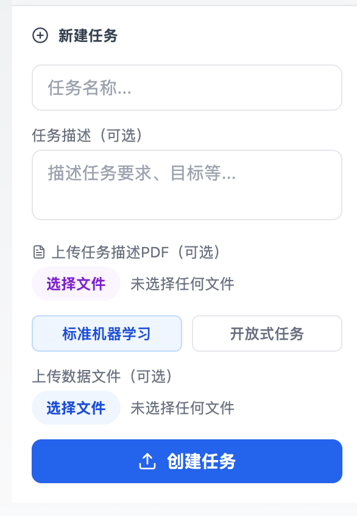
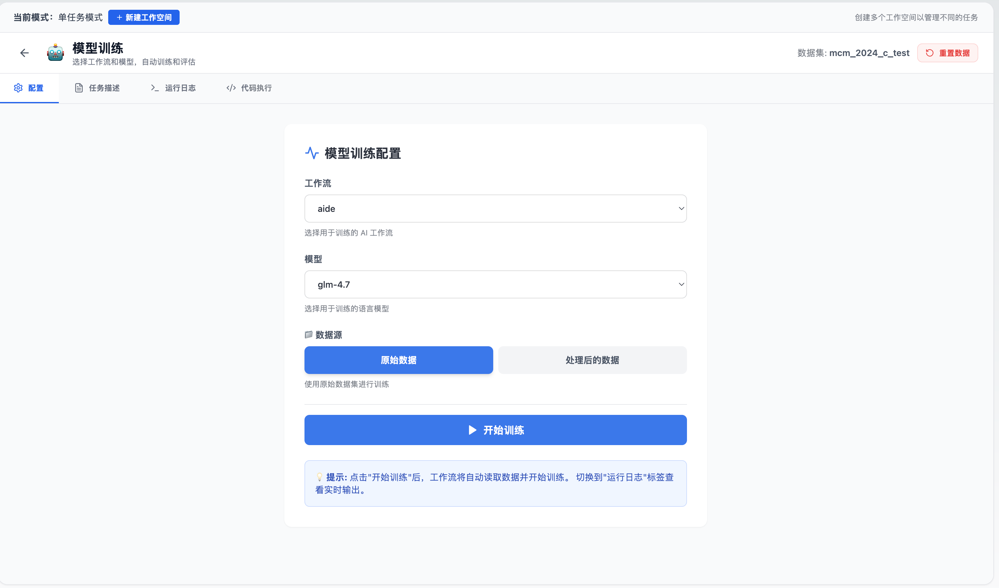
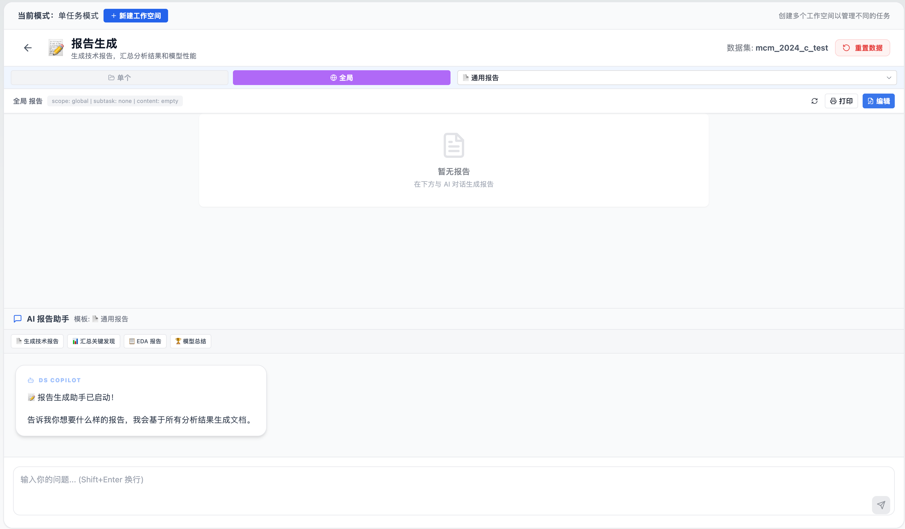

<div align="center">


# DSLIGHTING：全流程数据科学智能助手

[](https://www.python.org/downloads/)
[](https://fastapi.tiangolo.com/)
[](https://react.dev/)
[](https://nextjs.org/)
[](LICENSE)

<p align="center">
  <a href="#快速开始"></a>
  &nbsp;&nbsp;
  <a href="#核心功能"></a>
  &nbsp;&nbsp;
  <a href="https://luckyfan-cs.github.io/dslighting-web/"></a>
  &nbsp;&nbsp;
  <a href="https://luckyfan-cs.github.io/dslighting-web/guide/getting-started.html"></a>
  &nbsp;&nbsp;
  <a href="https://github.com/usail-hkust/dslighting/stargazers"></a>
  &nbsp;&nbsp;
  
</p>

[English](docs/README_EN.md) · [日本語](docs/README_JA.md) · [Français](docs/README_FR.md)

</div>

<div align="center">

🎯 **智能Agent工作流** &nbsp;•&nbsp; 📊 **交互式数据可视化**<br>
🤖 **自动化代码生成** &nbsp;•&nbsp; 📈 **全流程任务评估**

[💬 加入微信交流群](#-微信交流群) &nbsp;•&nbsp; [⭐ 给我们Star](https://github.com/usail-hkust/dslighting/stargazers)

</div>

---

## 📸 Web界面预览

### 主页面


### 数据探索 (EDA)


### 自定义任务


### 模型训练


### 报告生成


---

## 📖 项目简介

DSLIGHTING 是一个全流程数据科学智能助手系统，采用Agent式工作流和可复用的数据布局，为数据科学任务提供端到端的执行、评估和迭代能力。

### ✨ 核心特性

- 🤖 **多种Agent工作流**：集成aide、automind、dsagent等多种智能体风格
- 🔄 **元优化框架**：支持AFlow元优化，自动选择最优工作流
- 📊 **Web可视化界面**：基于Next.js + FastAPI的交互式Dashboard
- 📝 **完整日志追踪**：记录每次运行的artifacts和摘要
- 🧩 **可扩展架构**：灵活的任务注册和数据准备流程

---

## 🚀 快速开始

> 📖 **查看完整文档**：https://luckyfan-cs.github.io/dslighting-web/
>
> 💡 **需要详细配置步骤？** 查看 [完整配置指南](SETUP_GUIDE.md)

### 系统要求

- **Python**: 3.10 或更高版本
  ```bash
  # 检查Python版本
  python --version
  # 或
  python3 --version
  ```
- **Node.js**: 18.x 或更高版本
- **npm**: 9.x 或更高版本（随Node.js一起安装）
- **Git**: 用于版本控制

### 1. 环境准备

```bash
git clone https://github.com/usail-hkust/dslighting.git
cd dslighting
python3.10 -m venv dslighting
source dslighting/bin/activate  # Windows: dslighting\Scripts\activate
```

### 2. 安装依赖

**标准安装**（推荐）：
```bash
pip install -r requirements.txt
```

**备选方案**（如果标准安装出错）：
```bash
pip install -r requirements_local.txt
```

> 💡 **说明**：
> - `requirements.txt`：锁定具体版本，适合生产环境
> - `requirements_local.txt`：不锁定版本，依赖更灵活，适合开发环境

### 3. 配置API密钥

```bash
cp .env.example .env
# 编辑.env文件，设置你的API密钥
```

DSLighting支持多种LLM提供商：

**国内API提供商**（推荐）：
- **智谱AI** (https://bigmodel.cn/) - GLM系列模型
  - API Base: `https://open.bigmodel.cn/api/paas/v4`
  - 获取密钥: https://open.bigmodel.cn/usercenter/apikeys
- **硅基流动** (https://siliconflow.cn/) - DeepSeek、Qwen等多种模型
  - API Base: `https://api.siliconflow.cn/v1`
  - 获取密钥: https://siliconflow.cn/account/ak

**国际API提供商**：
- **OpenAI** (https://openai.com/) - GPT系列模型
  - API Base: `https://api.openai.com/v1`
  - 获取密钥: https://platform.openai.com/api-keys

支持通过 `API_KEY`/`API_BASE` 或 `LLM_MODEL_CONFIGS` 配置不同模型。

> 💡 **配置示例**: 查看 `.env.example` 文件获取详细的多模型配置示例，包括API密钥轮换、温度设置等。

### 4. 准备数据

DSLighting支持多种数据来源。目前支持以下数据准备方式：

#### 方式1：通过MLE-Bench下载（推荐）

[MLE-Bench](https://github.com/openai/mle-bench)是OpenAI提供的机器学习评估基准数据集。

```bash
# 1. 克隆MLE-Bench仓库
git clone https://github.com/openai/mle-bench.git
cd mle-bench

# 2. 安装依赖
pip install -e .

# 3. 下载所有数据集
python scripts/prepare.py --competition all

# 4. 将数据链接到DSLighting项目
# MLE-Bench数据默认在 ~/mle-bench/data/
# 可以创建符号链接或复制到 dslighting 项目
ln -s ~/mle-bench/data/competitions /path/to/dslighting/data/competitions
```

> 📖 **详细信息**: 查看 [MLE-Bench文档](https://github.com/openai/mle-bench) 了解更多数据集详情。

#### 方式2：自定义数据集

您也可以使用自己的数据集，只需按照DSLighting的数据布局结构组织：

```
data/competitions/
  <竞赛ID>/
    config.yaml           # 竞赛配置文件
    prepared/
      public/            # 公开数据（训练集、样本提交）
      private/           # 私有数据（测试标签，用于评分）
```

> 💡 **提示**: 更多数据类型和预训练模型支持正在陆续开放中，敬请期待！

> 📖 **详细数据准备指南**: 查看 [数据准备文档](docs/DATA_PREPARATION.md) 了解更多详情。

### 5. 运行单个任务

```bash
python run_benchmark.py \
  --workflow aide \
  --benchmark mle \
  --data-dir data/competitions \
  --task-id bike-sharing-demand \
  --llm-model gpt-4
```

### 6. 使用Web UI（推荐）

我们提供了基于 Next.js + FastAPI 的Web界面，让数据上传和任务执行更加便捷。

#### 6.1 后端环境配置

后端依赖主项目的dslighting环境，只需额外安装Web框架依赖：

```bash
source dslighting/bin/activate
# 安装后端依赖
pip install -r web_ui/backend/requirements.txt
```

#### 6.2 启动后端服务

```bash
# 进入后端目录
cd web_ui/backend

# 启动后端（默认端口8003）
python main.py
```

或者使用uvicorn直接启动：

```bash
cd web_ui/backend
uvicorn app.main:app --reload --host 0.0.0.0 --port 8003
```

> 📖 **详细文档**：查看 [后端README](web_ui/backend/README.md) 了解API端点和配置说明

> 💡 **提示**：后端默认运行在 **8003端口**。如果端口被占用，修改 `main.py` 中的端口号。

#### 6.3 启动前端服务

```bash
cd web_ui/frontend
npm install  # 首次运行时安装依赖
npm run dev  # 启动开发服务器
```

> 📖 **详细文档**：查看 [前端README](web_ui/frontend/README.md) 了解更多前端开发细节

#### 6.4 访问Dashboard

打开浏览器访问：[http://localhost:3000](http://localhost:3000)

---

## 🏗️ 核心功能

### Agent工作流

- **`aide`**：迭代式代码生成和审查循环
- **`automind`**：带记忆和任务分解的规划+推理
- **`dsagent`**：结构化操作符流程的规划/执行循环
- **`data_interpreter`**：快速代码执行和调试循环
- **`autokaggle`**：SOP风格的Kaggle工作流
- **`aflow`**：工作流的元优化
- **`deepanalyze`**：专注分析型执行工作流

### 数据布局

```
data/competitions/
  <竞赛ID>/
    config.yaml           # 竞赛配置文件
    prepared/
      public/            # 公开数据
      private/           # 私有数据
```

### 配置说明

`config.yaml` 会被基准测试运行器和LLM服务读取：

- `competitions`：MLEBench的默认竞赛列表
- `sciencebench_competitions`（可选）：ScienceBench的默认列表
- `custom_model_pricing`：LiteLLM的按模型token定价覆盖
- `run`：轨迹日志记录开关

---

## 📂 日志和Artifacts

默认日志写入路径：

```
runs/benchmark_results/<workflow>_on_<benchmark>/<model_name>/
```

可以通过 `--log-path` 参数覆盖基础目录。

---

## ❓ 常见问题

查看 `docs/FAQ.md` 获取更多详细信息。

---

## ⭐ Star History

<div align="center">

<p>
  <a href="https://github.com/usail-hkust/dslighting/stargazers"></a>
  &nbsp;&nbsp;
  <a href="https://github.com/usail-hkust/dslighting/network/members"></a>
</p>

<a href="https://www.star-history.com/#usail-hkust/dslighting&type=timeline&legend=top-left">
  <picture>
    <source media="(prefers-color-scheme: dark)" srcset="https://api.star-history.com/svg?repos=usail-hkust/dslighting&type=timeline&theme=dark&legend=top-left" />
    <source media="(prefers-color-scheme: light)" srcset="https://api.star-history.com/svg?repos=usail-hkust/dslighting&type=timeline&legend=top-left" />
    
  </picture>
</a>

</div>

---

## 💬 微信交流群

欢迎加入我们的微信交流群，与其他用户和开发者交流经验！

<div align="center">


**扫描上方二维码加入DSLighting用户交流群**

</div>

在群内您可以：
- 🤝 与其他用户交流使用经验
- 💡 提出功能建议和反馈
- 🐛 报告Bug并获得帮助
- 📢 了解最新开发动态

---

## 🤝 贡献指南

<div align="center">

我们希望 DSLIGHTING 能成为社区的一份礼物。🎁

<a href="https://github.com/usail-hkust/dslighting/graphs/contributors">
  
</a>

**核心贡献者**：
- [luckyfan-cs](https://github.com/luckyfan-cs)（项目负责人，前端和后端开发）
- [canchengliu](https://github.com/canchengliu)（工作流贡献）

查看 `docs/CONTRIBUTING.md` 了解如何参与贡献。

</div>

---

## 🔗 社区

<div align="center">

**[DSLIGHTING 社区](https://github.com/luckyfan-cs)**

[💬 微信交流群](#-微信交流群) · [⭐ 给我们Star](https://github.com/usail-hkust/dslighting/stargazers) · [🐛 报告Bug](https://github.com/usail-hkust/dslighting/issues) · [💬 参与讨论](https://github.com/usail-hkust/dslighting/discussions)

</div>

---

## 📄 许可证

本项目采用 AGPL-3.0 许可证。

---

## 🙏 致谢

感谢你关注 DSLIGHTING！

---

## 📊 项目统计


---

## 📚 引用 (Citation)

如果你在研究中使用了 DSLIGHTING，请使用以下 BibTeX 格式进行引用：

```bibtex
@software{dslighting2025,
  title = {DSLIGHTING: An End-to-End Data Science Intelligent Assistant System},
  author = {Liu, F. and Liu, C. and others},
  year = {2025},
  publisher = {GitHub},
  url = {https://github.com/usail-hkust/dslighting},
  version = {1.0.0}
}
```

或者使用 plain text 格式：

```
Liu, F., Liu, C., et al. (2025). DSLIGHTING: An End-to-End Data Science Intelligent Assistant System.
GitHub repository. https://github.com/usail-hkust/dslighting
```
