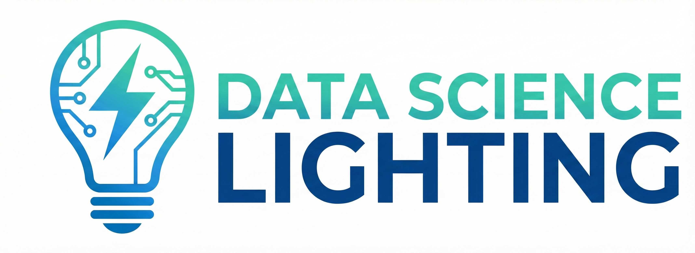
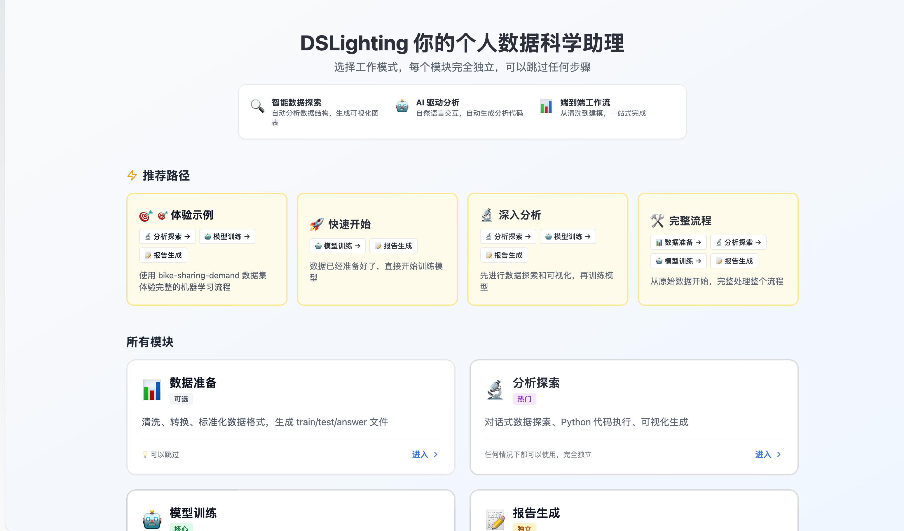
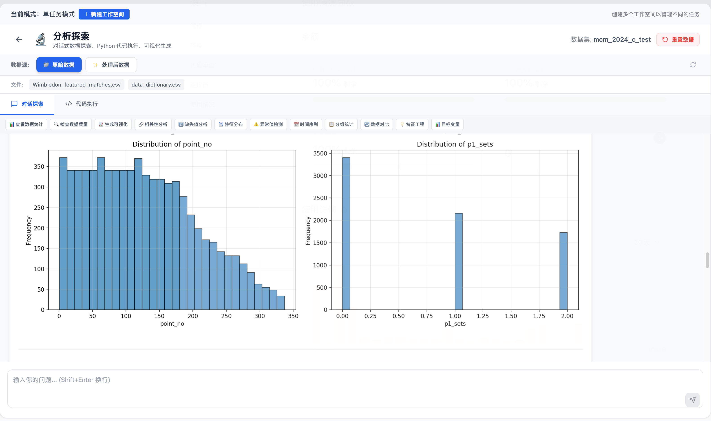
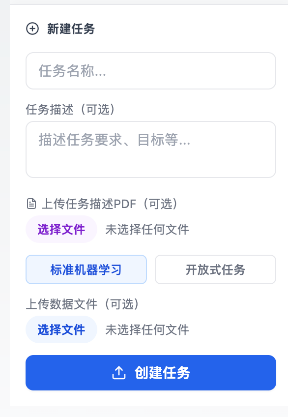
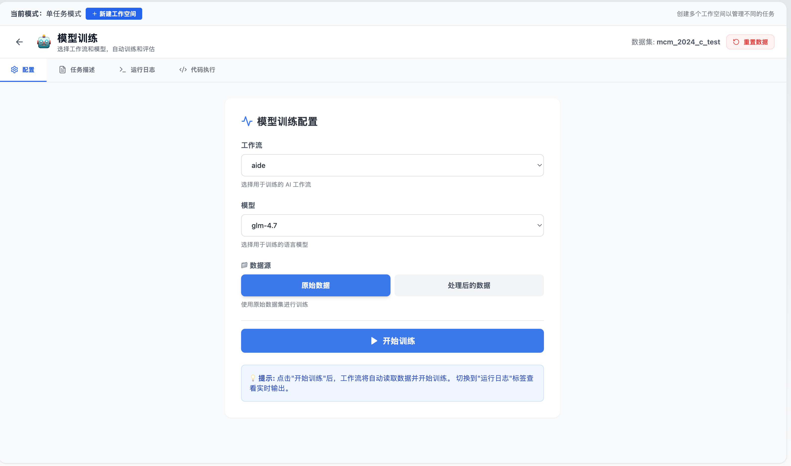
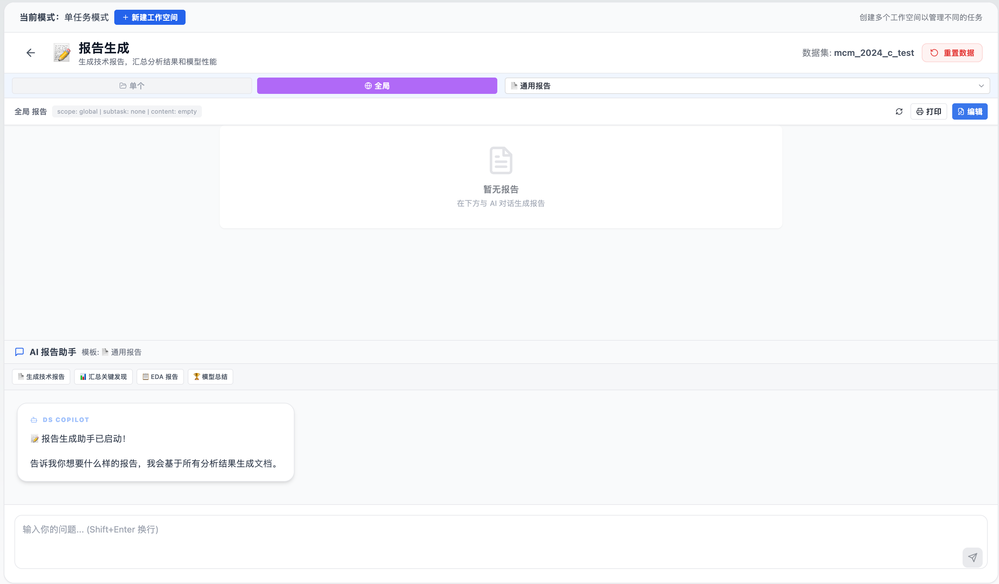

<div align="center">



# DSLIGHTING：全流程数据科学智能助手

[](https://www.python.org/downloads/)
[](https://pypi.org/project/dslighting/)
[](https://pypi.org/project/dslighting/)
[](https://fastapi.tiangolo.com/)
[](https://react.dev/)
[](https://nextjs.org/)
[](LICENSE)

<p align="center">
  <a href="#快速开始"></a>
  &nbsp;&nbsp;
  <a href="#核心功能"></a>
  &nbsp;&nbsp;
  <a href="https://luckyfan-cs.github.io/dslighting-web/"></a>
  &nbsp;&nbsp;
  <a href="https://luckyfan-cs.github.io/dslighting-web/guide/getting-started.html"></a>
  &nbsp;&nbsp;
  <a href="https://github.com/usail-hkust/dslighting/stargazers"></a>
  &nbsp;&nbsp;
  
</p>

[English](docs/README_EN.md) · [日本語](docs/README_JA.md) · [Français](docs/README_FR.md)

</div>

<div align="center">

🎯 **智能Agent工作流** &nbsp;•&nbsp; 📊 **交互式数据可视化**<br>
🤖 **自动化代码生成** &nbsp;•&nbsp; 📈 **全流程任务评估**

[💬 加入微信交流群](#-微信交流群) &nbsp;•&nbsp; [⭐ 给我们Star](https://github.com/usail-hkust/dslighting/stargazers)

</div>

---

## 📸 Web界面预览

### 主页面


### 数据探索 (EDA)


### 自定义任务


### 模型训练


### 报告生成


---

## 📖 项目简介

DSLIGHTING 是一个全流程数据科学智能助手系统，采用Agent式工作流和可复用的数据布局，为数据科学任务提供端到端的执行、评估和迭代能力。

### ✨ 核心特性

- 🤖 **多种Agent工作流**：集成aide、automind、dsagent等多种智能体风格
- 🔄 **元优化框架**：支持AFlow元优化，自动选择最优工作流
- 📊 **Web可视化界面**：基于Next.js + FastAPI的交互式Dashboard
- 📝 **完整日志追踪**：记录每次运行的artifacts和摘要
- 🧩 **可扩展架构**：灵活的任务注册和数据准备流程
- 📦 **智能包上下文** (v1.4.0+)：自动检测环境中的可用包，避免生成不兼容代码
- 🎯 **内置数据集** (v1.8.1+)：开箱即用的示例数据集，无需额外准备

---

### 🆕 快速体验

#### 📦 第一步：安装 DSLighting

```bash
# 创建虚拟环境（推荐）
python3 -m venv dslighting-env
source dslighting-env/bin/activate  # Windows: dslighting-env\Scripts\activate

# 安装 DSLighting
pip install dslighting
```

#### ⚙️ 第二步：配置 API 密钥

创建 `.env` 文件并配置你的 API 密钥：

```bash
# .env 文件内容
API_KEY=sk-your-api-key-here
API_BASE=https://api.openai.com/v1
LLM_MODEL=gpt-4o
```

**支持的 API 提供商**：
- **OpenAI**: https://openai.com/ - API Base: `https://api.openai.com/v1`
- **智谱AI** (推荐): https://bigmodel.cn/ - API Base: `https://open.bigmodel.cn/api/paas/v4`
- **硅基流动**: https://siliconflow.cn/ - API Base: `https://api.siliconflow.cn/v1`

**最小可运行示例**

`.env` 最小配置：

```bash
API_KEY=your_key
API_BASE=https://api.openai.com/v1
LLM_MODEL=gpt-4o
```

Python 示例：

```python
from dotenv import load_dotenv
load_dotenv()  # 读取项目根目录 .env

import dslighting

result = dslighting.run_agent(
    task_id="bike-sharing-demand",   # 内置任务ID
    workflow="aide",                 # 可选，默认 aide
    model="gpt-4o",                  # 可选，默认值由配置决定
)

print(result.success, result.score, result.cost)
# 常用字段: success / score / cost / duration / output / error
```

#### 🎯 第三步：选择使用方式

---

**🌱 新手模式（推荐初学者）**

##### 方式 1️⃣：使用内置数据集（零配置）

**无需准备数据，一行代码运行！**

```python
# run_builtin.py
from dotenv import load_dotenv
load_dotenv()

import dslighting

# 使用内置数据集，无需配置数据路径
result = dslighting.run_agent(
    task_id="bike-sharing-demand",
    workflow="aide",    # 可选，默认 aide
    model="gpt-4o",     # 可选，默认读取配置
)

print(f"✅ 成功: {result.success}")
print(f"📊 分数: {result.score}")
print(f"💰 成本: ${result.cost}")
```

**内置数据集**：
- `bike-sharing-demand` - 共享单车需求预测
- ✅ 包含完整的训练集、测试集和答案文件
- ✅ 开箱即用，无需下载
- ✅ 适合快速体验和测试

##### 方式 2️⃣：开放式 API（推荐新手）

**数据分析、处理、建模三大功能**

```python
import dslighting

# 分析 - 探索数据（2 次迭代，保留工作空间）
result = dslighting.analyze(
    data="./data/titanic",
    description="分析乘客数据分布",
    model="gpt-4o"
)

# 处理 - 清洗数据（3 次迭代，保留工作空间）
result = dslighting.process(
    data="./data/titanic",
    description="清洗缺失值和异常值",
    model="gpt-4o"
)

# 建模 - 训练模型（4 次迭代，保留工作空间）
result = dslighting.model(
    data="./data/titanic",
    description="训练生存预测模型",
    model="gpt-4o"
)
```

**特点**：
- 🎯 **简单直观**：三个 API 对应三种常见任务
- 🔄 **自动迭代**：根据任务类型设置合理的默认迭代次数
- 📁 **保留结果**：自动保留工作空间，方便查看生成的代码和文件

📖 **完整教程**: [examples/open_ended_demo/README.md](examples/open_ended_demo/README.md)

---

**🚀 高级模式（适合进阶用户）**

##### 方式 3️⃣：全局配置

**配置一次，全局生效**

```python
import dslighting

# 配置数据目录和注册表目录
dslighting.setup(
    data_parent_dir="/path/to/data/competitions",
    registry_parent_dir="/path/to/registry"
)

# 之后只需提供 task_id
agent = dslighting.Agent()
result = agent.run(task_id="my-custom-task")
```

**高级模式特点**：
- 🔧 **统一管理**：集中管理多个任务的数据和配置
- 📊 **批量处理**：适合处理多个竞赛任务
- ⚡ **高效执行**：减少重复配置，提高工作效率

##### 方式 4️⃣：定义自定义 Agent（专家模式）

**灵活构建专属 Agent，完全控制工作流程**

通过定义 **Operator**（操作符）、**Workflow**（工作流）和 **Factory**（工厂），你可以构建完全自定义的 Agent 来处理复杂任务。

**示例：构建自定义 Agent**

```python
from dslighting.arch.interfaces import WorkflowFactoryInterface
from dslighting.arch.operators import Operator
from dslighting.arch.services import LLMService, SandboxService, WorkspaceService
from dslighting.arch.state import JournalState
from dslighting.arch.workflows import BaseWorkflow, BaseWorkflowFactory

# 1. 定义操作符（可复用能力）
class SummarizeOperator(Operator):
    async def __call__(self, text: str) -> dict:
        return {"summary": text[:200]}

summarize_op = SummarizeOperator()

# 2. 定义工作流（统一继承 BaseWorkflow）
class MyWorkflow(BaseWorkflow):
    def __init__(self, operators, services, config=None):
        self.operators = operators
        self.services = services
        self.config = config or {}

    async def solve(self, description, io_instructions, data_dir, output_path):
        _ = await self.operators["summarize"](text=description)

# 3. 创建工厂（统一继承 BaseWorkflowFactory）
class MyWorkflowFactory(BaseWorkflowFactory, WorkflowFactoryInterface):
    def __init__(self, model="openai/gpt-4o", **kwargs):
        super().__init__(model=model, **kwargs)

    def create_agent(self, **kwargs):
        operators = {"summarize": summarize_op}
        services = {
            "llm": LLMService(model=self.model),
            "sandbox": SandboxService(),
            "workspace": WorkspaceService(),
            "state": JournalState(),
        }
        return MyWorkflow(operators=operators, services=services, config=kwargs)

# 4. 使用自定义 Agent
agent = MyWorkflowFactory(
    model="openai/deepseek-ai/DeepSeek-V3.1-Terminus"
).create_agent(max_iterations=3)
```

**核心概念**：
- **Operator**：`dslighting.arch.operators` 的原子能力
- **Workflow**：统一继承 `dslighting.arch.workflows.BaseWorkflow`
- **Factory**：统一继承 `dslighting.arch.workflows.BaseWorkflowFactory`

**使用场景**：
- 🎯 需要特定的任务执行逻辑
- 🔬 研究新的 Agent 架构
- 🧩 组合多个专用能力
- 📈 优化特定领域的工作流

**最佳实践**：
- ✅ 保持输出灵活：报告、图表、模型文件都可以
- ✅ 使用沙箱执行：确保代码安全
- ✅ 偏好小而美的操作符：通过组合构建复杂功能

📖 **完整教程**: [AdvancedDSAgent 示例](https://github.com/usail-hkust/dslighting/tree/main/examples/advanced_custom_agent)

---

---

## 🚀 快速开始

> 📖 **查看完整文档**：https://luckyfan-cs.github.io/dslighting-web/
>
> 💡 **需要详细配置步骤？** 查看 [完整配置指南](SETUP_GUIDE.md)

### 系统要求

- **Python**: 3.10 或更高版本
  ```bash
  # 检查Python版本
  python --version
  # 或
  python3 --version
  ```
- **Node.js**: 18.x 或更高版本
- **npm**: 9.x 或更高版本（随Node.js一起安装）
- **Git**: 用于版本控制

### 1. 环境准备

```bash
git clone https://github.com/usail-hkust/dslighting.git
cd dslighting
python3.10 -m venv dslighting
source dslighting/bin/activate  # Windows: dslighting\Scripts\activate
```

### 2. 安装依赖

**标准安装**（推荐）：
```bash
pip install -r requirements.txt
```

**备选方案**（如果标准安装出错）：
```bash
pip install -r requirements_local.txt
```

> 💡 **说明**：
> - `requirements.txt`：锁定具体版本，适合生产环境
> - `requirements_local.txt`：不锁定版本，依赖更灵活，适合开发环境
>
> ⚠️ **兼容性提示**：如果安装后运行时报 `ModuleNotFoundError: aiofiles`，请在同一虚拟环境执行：
> ```bash
> pip install aiofiles
> ```

### 3. 配置API密钥

```bash
cp .env.example .env
# 编辑.env文件，设置你的API密钥
```

DSLighting支持多种LLM提供商：

**国内API提供商**（推荐）：
- **智谱AI** (https://bigmodel.cn/) - GLM系列模型
  - API Base: `https://open.bigmodel.cn/api/paas/v4`
  - 获取密钥: https://open.bigmodel.cn/usercenter/apikeys
- **硅基流动** (https://siliconflow.cn/) - DeepSeek、Qwen等多种模型
  - API Base: `https://api.siliconflow.cn/v1`
  - 获取密钥: https://siliconflow.cn/account/ak

**国际API提供商**：
- **OpenAI** (https://openai.com/) - GPT系列模型
  - API Base: `https://api.openai.com/v1`
  - 获取密钥: https://platform.openai.com/api-keys

支持通过 `API_KEY`/`API_BASE` 或 `LLM_MODEL_CONFIGS` 配置不同模型。

> 💡 **配置示例**: 查看 `.env.example` 文件获取详细的多模型配置示例，包括API密钥轮换、温度设置等。

### 4. 准备数据

DSLighting支持多种数据来源。目前支持以下数据准备方式：

#### 方式1：通过MLE-Bench下载（推荐）

[MLE-Bench](https://github.com/openai/mle-bench)是OpenAI提供的机器学习评估基准数据集。

```bash
# 1. 克隆MLE-Bench仓库
git clone https://github.com/openai/mle-bench.git
cd mle-bench

# 2. 安装依赖
pip install -e .

# 3. 下载所有数据集
python scripts/prepare.py --competition all

# 4. 将数据链接到DSLighting项目
# MLE-Bench数据默认在 ~/mle-bench/data/
# 可以创建符号链接或复制到 dslighting 项目
ln -s ~/mle-bench/data/competitions /path/to/dslighting/data/competitions
```

> 📖 **详细信息**: 查看 [MLE-Bench文档](https://github.com/openai/mle-bench) 了解更多数据集详情。

#### 方式2：自定义数据集

您也可以使用自己的数据集，只需按照DSLighting的数据布局结构组织：

```
data/competitions/
  <竞赛ID>/
    config.yaml           # 竞赛配置文件
    prepared/
      public/            # 公开数据（训练集、样本提交）
      private/           # 私有数据（测试标签，用于评分）
```

> 💡 **提示**: 更多数据类型和预训练模型支持正在陆续开放中，敬请期待！

> 📖 **详细数据准备指南**: 查看 [数据准备文档](docs/DATA_PREPARATION.md) 了解更多详情。

### 5. 运行任务

```bash
python -m dslighting.cli --version
```

```bash
python - <<'PY'
from dslighting import DSBenchmark

benchmark = DSBenchmark(
    benchmark_type="custom",
    data_dir="data/competitions",
    vendor_comp_dir="dslighting/benchmark/vendor/mlebench/competitions",
    competitions=["bike-sharing-demand"],
    exp_name="bike_sharing_demo",
).run(
    workflow="aide",
    model="gpt-4o",  # 本地测试可替换为 openai/deepseek-ai/DeepSeek-V3.1-Terminus
    max_iterations=3,
    log_path="./runs/benchmarks/bike_sharing_demo",
)

print("results:", benchmark.results_path)
print("metadata:", benchmark.metadata_path)
PY
```

### 6. 使用Web UI（推荐）

我们提供了基于 Next.js + FastAPI 的Web界面，让数据上传和任务执行更加便捷。

#### 6.1 后端环境配置

后端依赖主项目的dslighting环境，只需额外安装Web框架依赖：

```bash
source dslighting/bin/activate
# 安装后端依赖
pip install -r web_ui/backend/requirements.txt
```

#### 6.2 启动后端服务

```bash
# 进入后端目录
cd web_ui/backend

# 启动后端（默认端口8003）
python main.py
```

或者使用uvicorn直接启动：

```bash
cd web_ui/backend
uvicorn app.main:app --reload --host 0.0.0.0 --port 8003
```

> 📖 **详细文档**：查看 [后端README](web_ui/backend/README.md) 了解API端点和配置说明

> 💡 **提示**：后端默认运行在 **8003端口**。如果端口被占用，修改 `main.py` 中的端口号。

#### 6.3 启动前端服务

```bash
cd web_ui/frontend
npm install  # 首次运行时安装依赖
npm run dev  # 启动开发服务器
```

> 📖 **详细文档**：查看 [前端README](web_ui/frontend/README.md) 了解更多前端开发细节

#### 6.4 访问Dashboard

打开浏览器访问：[http://localhost:3000](http://localhost:3000)

---

## 🏗️ 核心功能

### Agent工作流

- **`aide`**：迭代式代码生成和审查循环
- **`automind`**：带记忆和任务分解的规划+推理
- **`dsagent`**：结构化操作符流程的规划/执行循环
- **`data_interpreter`**：快速代码执行和调试循环
- **`autokaggle`**：SOP风格的Kaggle工作流
- **`aflow`**：工作流的元优化
- **`deepanalyze`**：专注分析型执行工作流

### 核心架构（贡献者视角）

```
┌─────────────────────────────────────────┐
│ 1) Agent 编排层                         │
│    工作流生命周期与调度                  │
│    dslighting/workflows, runner.py      │
└──────────────┬──────────────────────────┘
               │
┌──────────────▼──────────────────────────┐
│ 2) 认知 / Operator 层                   │
│    规划 / 生成 / 执行 / 评审             │
│    dslighting/ops, prompts, state       │
└──────────────┬──────────────────────────┘
               │
┌──────────────▼──────────────────────────┐
│ 3) 执行 / 服务层                        │
│    LLMService, Sandbox, Workspace, DAG  │
│    dslighting/services, runtime         │
└──────────────┬──────────────────────────┘
               │
┌──────────────▼──────────────────────────┐
│ 4) 领域核心层                           │
│    配置、任务、接口、结果映射            │
│    dslighting/core, benchmark, datasets │
└──────────────┬──────────────────────────┘
               │
┌──────────────▼──────────────────────────┐
│ 5) 基础设施层                           │
│    error, monitoring, checkpoint, utils │
│    dslighting/error, monitoring, utils  │
└─────────────────────────────────────────┘
```

### 数据布局

```
data/competitions/
  <竞赛ID>/
    config.yaml           # 竞赛配置文件
    prepared/
      public/            # 公开数据
      private/           # 私有数据
```

### 配置说明

#### 基础配置

`config.yaml` 会被基准测试运行器和LLM服务读取：

- `competitions`：MLEBench的默认竞赛列表
- `sciencebench_competitions`（可选）：ScienceBench的默认列表
- `custom_model_pricing`：LiteLLM的按模型token定价覆盖
- `run`：轨迹日志记录开关

#### 自定义模型价格配置

**默认行为**：
- DSLighting 使用 LiteLLM 的内置默认价格
- 如果没有 `config.yaml`，系统会正常工作，**不会报错**
- 价格配置是**可选的**，仅在需要覆盖默认价格时使用

**自定义价格配置**：

如果需要为自定义模型设置价格，可以在项目目录创建 `config.yaml` 文件：

**位置**：
```bash
# 对于 pip 安装
/path/to/your/project/config.yaml

# 示例：测试项目中
/Users/liufan/Applications/Github/dslighting_test_project/config.yaml
```

> 📖 **参考示例**：查看 [config.yaml.example](config.yaml.example) 获取完整配置示例

**配置示例**：
```yaml
custom_model_pricing:
  openai/Qwen/Qwen3-Coder-480B-A35B-Instruct:
    input_cost_per_token: 6.0e-07
    output_cost_per_token: 1.8e-06
  openai/Qwen/Qwen3-Coder-30B-A3B-Instruct:
    input_cost_per_token: 6.0e-07
    output_cost_per_token: 1.8e-06
  o4-mini-2025-04-16:
    input_cost_per_token: 1.1e-06
    output_cost_per_token: 4.4e-06
  openai/deepseek-ai/DeepSeek-V3.1-Terminus:
    input_cost_per_token: 5.55e-07
    output_cost_per_token: 1.67e-06
```

**价格参数说明**：
- `input_cost_per_token`：输入 token 价格（每次请求）
- `output_cost_per_token`：输出 token 价格（每次响应）
- 单位：美元/token（通常为科学计数法）

**注意事项**：
- 💡 价格配置是**可选的**，没有 config.yaml 也不会报错
- 💡 只需要覆盖需要自定义的模型，其他模型使用默认价格
- 💡 价格配置会影响成本计算和预算控制

---

## 📂 日志和Artifacts

默认日志写入路径：

```
runs/benchmark_results/<workflow>_on_<benchmark>/<model_name>/
```

可以通过 `--log-path` 参数覆盖基础目录。

---

## ❓ 常见问题

查看 `docs/FAQ.md` 获取更多详细信息。

---

## ⭐ Star History

<div align="center">

<p>
  <a href="https://github.com/usail-hkust/dslighting/stargazers"></a>
  &nbsp;&nbsp;
  <a href="https://github.com/usail-hkust/dslighting/network/members"></a>
</p>

<a href="https://www.star-history.com/#usail-hkust/dslighting&type=timeline&legend=top-left">
  <picture>
    <source media="(prefers-color-scheme: dark)" srcset="https://api.star-history.com/svg?repos=usail-hkust/dslighting&type=timeline&theme=dark&legend=top-left" />
    <source media="(prefers-color-scheme: light)" srcset="https://api.star-history.com/svg?repos=usail-hkust/dslighting&type=timeline&legend=top-left" />
    
  </picture>
</a>

</div>

---

## 💬 微信交流群

欢迎加入我们的微信交流群，与其他用户和开发者交流经验！

<div align="center">


**扫描上方二维码加入DSLighting用户交流群**

</div>

在群内您可以：
- 🤝 与其他用户交流使用经验
- 💡 提出功能建议和反馈
- 🐛 报告Bug并获得帮助
- 📢 了解最新开发动态

---

## 🤝 贡献指南

<div align="center">

我们希望 DSLIGHTING 能成为社区的一份礼物。🎁

<a href="https://github.com/usail-hkust/dslighting/graphs/contributors">
  
</a>

**核心贡献者**：
- [luckyfan-cs](https://github.com/luckyfan-cs)（项目负责人，前端和后端开发）
- [canchengliu](https://github.com/canchengliu)（工作流贡献）

查看 `docs/CONTRIBUTING.md` 了解如何参与贡献。

</div>

---

## 🔗 社区

<div align="center">

**[DSLIGHTING 社区](https://github.com/luckyfan-cs)**

[💬 微信交流群](#-微信交流群) · [⭐ 给我们Star](https://github.com/usail-hkust/dslighting/stargazers) · [🐛 报告Bug](https://github.com/usail-hkust/dslighting/issues) · [💬 参与讨论](https://github.com/usail-hkust/dslighting/discussions)

</div>

---

## 📄 许可证

本项目采用 AGPL-3.0 许可证。

---

## 🙏 致谢

感谢你关注 DSLIGHTING！

---

## 📊 项目统计


---

## 📚 引用 (Citation)

如果你在研究中使用了 DSLIGHTING，请使用以下 BibTeX 格式进行引用：

```bibtex
@software{dslighting2025,
  title = {DSLIGHTING: An End-to-End Data Science Intelligent Assistant System},
  author = {Liu, F. and Liu, C. and others},
  year = {2025},
  publisher = {GitHub},
  url = {https://github.com/usail-hkust/dslighting},
  version = {1.0.0}
}
```

或者使用 plain text 格式：

```
Liu, F., Liu, C., et al. (2025). DSLIGHTING: An End-to-End Data Science Intelligent Assistant System.
GitHub repository. https://github.com/usail-hkust/dslighting
```
